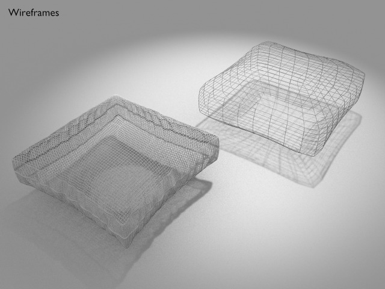

Pillow
===





License
===

```
© 2016 Mark Raynsford <visual@io7m.com>

This work is licensed under a Creative Commons Attribution 4.0
International License.

You should have received a copy of the license along with this
work. If not, see <http://creativecommons.org/licenses/by/4.0/>.

```

Scene statistics
===

```
Mesh: pillow_low_poly_mesh
  Polygons: 112
  Textures:
    Image: pillow_low_normals 512x256
    Image: pillow_low_albedo_ao 512x256

Mesh: pillow_sculpt
  Polygons: 81920
  Textures:
    Image: fabric_bump.png 1024x1024
    Image: fabric_albedo.png 1024x1024

```

